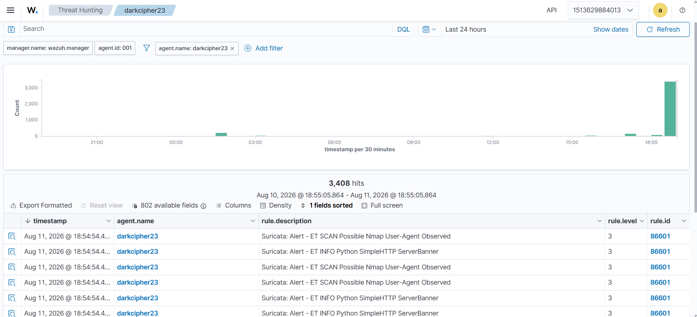

# SOCForge - Autonomous AI SOC Triage & SOAR Engine

> An enterprise-grade, AI-assisted Security Operations Center (SOC) ecosystem. **SOCForge** ingests host telemetry via Sysmon and Wazuh SIEM, normalizes security events through a FastAPI middleware pipeline, and leverages LLM capabilities for real-time alert triage, threat scoring, and automated SOAR playbook execution.

Phase 1 Status: Deployment Verified

- [x] **Dockerized Wazuh SIEM Stack Deployed** (Indexer, Manager, Dashboard running on WSL2 / L: Drive)
- [x] **Windows 11 Host Agent** (`windows-host`) paired and active
- [x] **Kali Linux VM Agent** (`darkcipher23`) paired and active

Phase 2: Host & Network Detection Pipelines
- [x] **Suricata IDS Integration:** Real-time network intrusion monitoring (Nmap scan & HTTP banner detection)
- [x] **File Integrity Monitoring (FIM):** Real-time tracking of file additions (Rule 554) and deletions (Rule 553)

---

## Detection Verification & Evidence

#### 1. Active Endpoints Dashboard

#### 2. Network Intrusion Detection (Suricata IDS)
*Capturing Nmap user-agent scans and reconnaissance activity on Kali endpoint (`darkcipher23`).*

#### 3. File Integrity Monitoring (FIM)
*Real-time Syscheck alerts tracking file creation and deletion events.*

---

