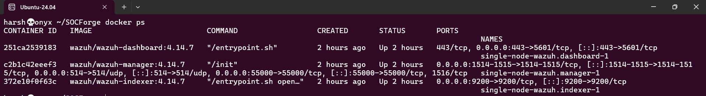
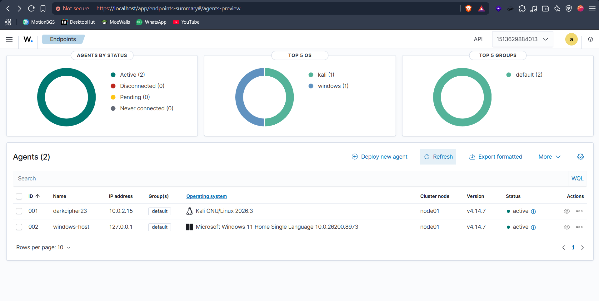
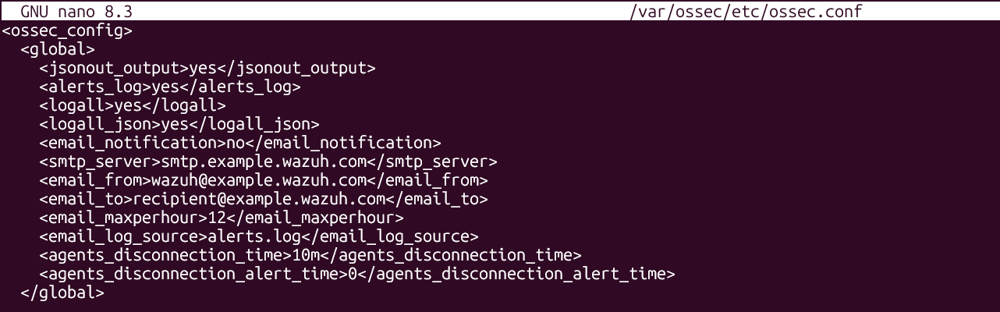
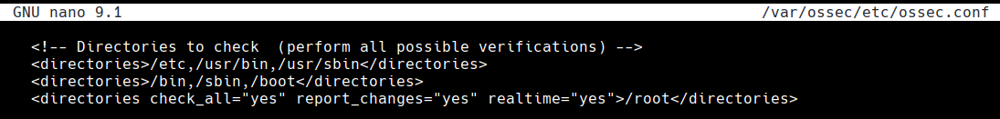
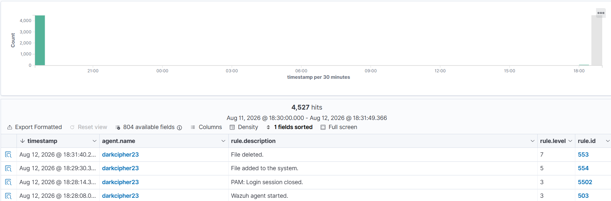

# SOCForge - Autonomous AI SOC Triage & SOAR Engine

> An enterprise-grade, AI-assisted Security Operations Center (SOC) ecosystem. **SOCForge** ingests host telemetry via Sysmon and Wazuh SIEM, normalizes security events through a FastAPI middleware pipeline, and leverages LLM capabilities for real-time alert triage, threat scoring, and automated SOAR playbook execution.

Phase 1 Status: Deployment Verified

- [x] **Dockerized Wazuh SIEM Stack Deployed** (Indexer, Manager, Dashboard running on WSL2 / L: Drive)



- [x] **Windows 11 Host Agent** (`windows-host`) paired and active
- [x] **Kali Linux VM Agent** (`darkcipher23`) paired and active



---

## Detection Verification & Evidence

### 📂 Hands-on Lab 1: File Integrity Monitoring (FIM)

* **Objective:** Monitor critical directories (`/root`) in real-time for unauthorized file additions, modifications, or deletions.

* **Server Manager Config (`/var/ossec/etc/ossec.conf`):** Changed `no` to `yes` in the following two lines
  ```xml
    <logall>yes</logall>
    <logall_json>yes</logall_json>
   ```



* **Agent/Client Config (`/var/ossec/etc/ossec.conf`):** Added real-time syscheck monitoring for `/root`
  ```xml
  <directories check_all="yes" report_changes="yes" realtime="yes">/root</directories>
   ```


* **Real-Time Alert Verification:**
Created and deleted test files inside /root. Wazuh immediately captured the events, firing Rule 554 (File added to the system) and Rule 553 (File deleted).



---
