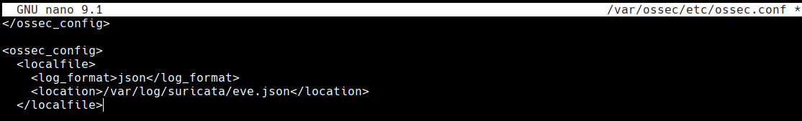
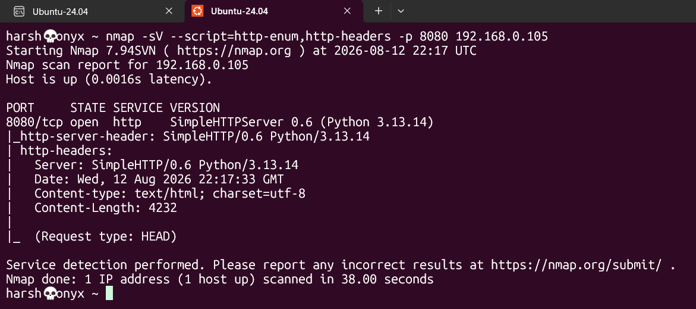
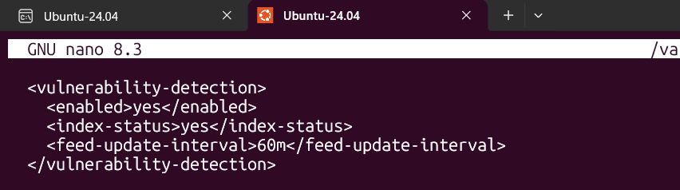
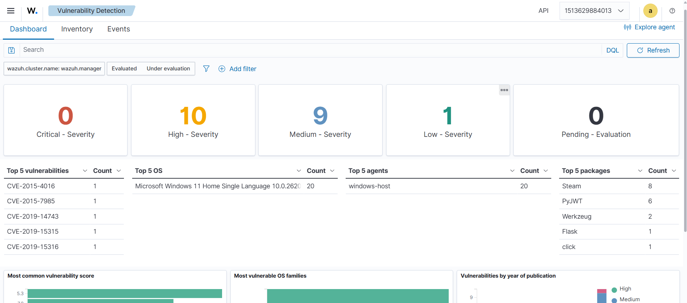
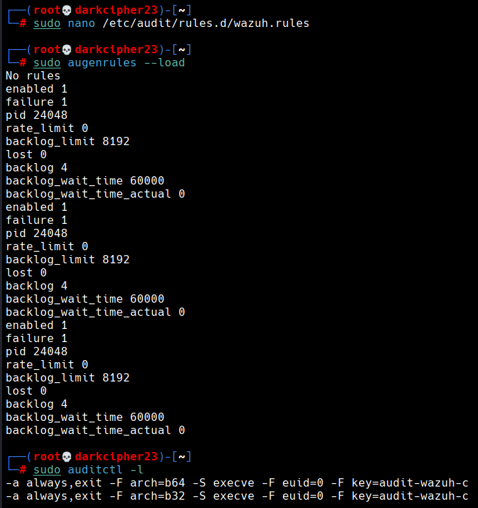
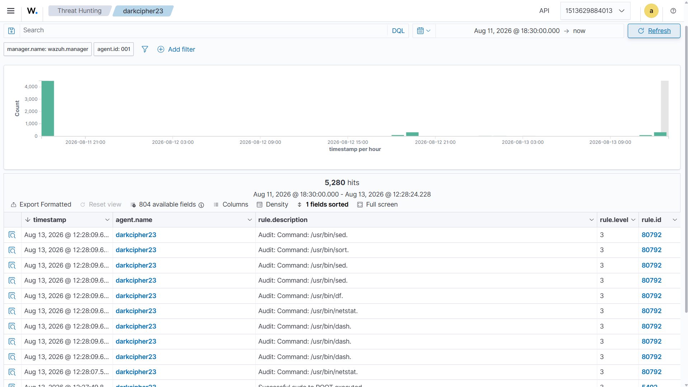
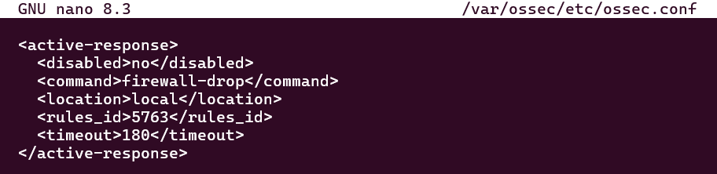
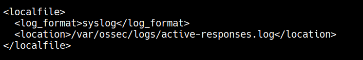
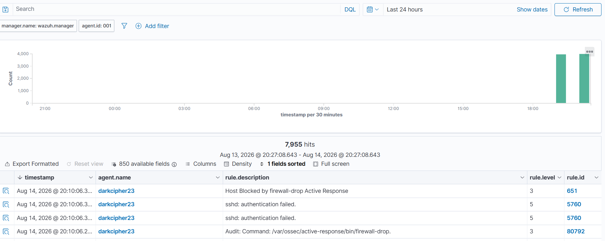

# SOCForge - Autonomous AI SOC Triage & SOAR Engine

> An enterprise-grade, AI-assisted Security Operations Center (SOC) ecosystem. SOCForge ingests host telemetry via multi-platform Wazuh agents, normalizes security events through a FastAPI middleware pipeline, and leverages LLM capabilities for real-time alert triage, threat scoring, and automated SOAR playbook execution.

Phase 1 Status: Deployment Verified

- [x] **Dockerized Wazuh SIEM Stack Deployed** (Indexer, Manager, Dashboard running on WSL2 / L: Drive)


- [x] **Windows 11 Host Agent** (`windows-host`) paired and active
- [x] **Kali Linux VM Agent** (`darkcipher23`) paired and active


---

## Detection Verification & Evidence

### Hands-on Lab 1: File Integrity Monitoring (FIM)

* **Objective:** Monitor critical directories (`/root`) in real-time for unauthorized file additions, modifications, or deletions.

* **Server Manager Config (`/var/ossec/etc/ossec.conf`):** Changed `no` to `yes` in the following two lines
  ```xml
    <logall>yes</logall>
    <logall_json>yes</logall_json>
   ```


* **Agent/Client Config (`/var/ossec/etc/ossec.conf`):** Added real-time syscheck monitoring for `/root`
  ```xml
  <directories check_all="yes" report_changes="yes" realtime="yes">/root</directories>
   ```


* **Real-Time Alert Verification:** Created and deleted test files inside /root. Wazuh immediately captured the events, firing Rule 554 (File added to the system) and Rule 553 (File deleted).


### Hands-on Lab 2: Detecting Network Intrusion using Suricata IDS

* **Objective:** Ingest real-time network threat telemetry by integrating Suricata IDS on the Kali Linux agent (`darkcipher23`) to detect port scans, network reconnaissance, and suspicious user-agents.

* **Agent/Client Config (`/var/ossec/etc/ossec.conf` on Kali Linux):** Configured the Wazuh Agent log-collector daemon to parse Suricata's JSON event output (`eve.json`):
  ```xml
  <localfile>
    <log_format>json</log_format>
    <location>/var/log/suricata/eve.json</location>
  </localfile>
  ```


* **Ruleset:** Utilized default Emerging Threats (ET) Open ruleset managed via `suricata-update`.

* **Attack Simulation:** Executed Nmap network service enumeration and user-agent probing against target services to simulate adversary reconnaissance:
  ```bash
  nmap -sV --script=http-enum,http-headers -p 8080 192.168.0.105
  ```


* **Real-Time Alert Verification:** Suricata analyzed incoming network packets, generated JSON alerts in eve.json, and passed them to Wazuh Manager. The manager matched rule signatures, firing Rule 86601 (Suricata: Alert - ET SCAN Possible Nmap User-Agent Observed).


### Hands-on Lab 3: Detecting Vulnerabilities

* **Objective:** Automatically audit endpoint software inventories against National Vulnerability Database (NVD) CVE feeds to identify unpatched software and quantify host risk exposure.

* **Server Manager Config (`/var/ossec/etc/ossec.conf` on Wazuh Manager):** Enabled the `vulnerability-detection` module with automated NVD feed synchronization:
  ```xml
  <vulnerability-detection>
    <enabled>yes</enabled>
    <run_on_start>yes</run_on_start>
    <interval>5m</interval>
  </vulnerability-detection>
  ```


* **Real-Time Audit Verification:** Wazuh scanned installed application package inventories on windows-host and correlated them against vulnerability feeds. It flagged 20 total vulnerabilities (10 High, 9 Medium, 1 Low), identifying high-risk exposures across application frameworks (PyJWT, Werkzeug, Flask) and desktop software (Steam).



### Hands-on Lab 4: Detecting Execution of Malicious Commands via Auditd

* **Objective:** Audit system calls (`execve`) on Kali Linux (`darkcipher23`) to capture process creation and command-line execution parameters in real time.

* **Agent/Client Config (/var/ossec/etc/ossec.conf on Kali Linux):** Added localfile log collector for kernel audit logs:
  ```xml
  <localfile>
    <log_format>audit</log_format>
    <location>/var/log/audit/audit.log</location>
  </localfile>
  ```

* **Kernel Audit Rule Config (`/etc/audit/rules.d/wazuh.rules`):**
  Configured persistent kernel audit rules targeting 64-bit and 32-bit execution system calls (`execve`) under elevated root privileges (`euid=0`):
  ```text
  -a exit,always -F euid=0 -F arch=b64 -S execve -k audit-wazuh-c
  -a exit,always -F euid=0 -F arch=b32 -S execve -k audit-wazuh-c
  ```


* **Real-Time Command Execution & Alert Verification:** Executed reconnaissance and system tools (netstat, df, sort, sed). Wazuh parsed /var/log/audit/audit.log and fired Rule 80792 (Audit: Command execution captured), logging the exact binary paths and process details.



### ands-on Lab 5: Automated SSH Brute-Force Detection & Active Response Mitigation

* **Objective:** Simulate an automated SSH brute-force attack using `hydra`, trigger signature-based detection rules in Wazuh, and automatically block the attacking IP in real time using Wazuh's **Active Response** firewall-drop integration.

* **Attack Simulation Vector (Hydra):**
  Executed a targeted dictionary attack against the SSH service on the target endpoint:
  ```bash
  hydra -t 4 -l root -P /usr/share/john/password.lst 192.168.0.105 ssh
  ```

* **Wazuh Manager Configuration (/var/ossec/etc/ossec.conf):** Configured an active response block to trigger the firewall-drop script locally for 180 seconds whenever Rule 5763 (SSHD brute force attempt) is fired:
  ```xml
  <active-response>
    <disabled>no</disabled>
    <command>firewall-drop</command>
    <location>local</location>
    <rules_id>5763</rules_id>
    <timeout>180</timeout>
  </active-response>
  ```


* **Wazuh Agent Active Response Ingestion (/var/ossec/etc/ossec.conf):** Ensured the agent forwards local mitigation logs to the manager for auditing:
  ```xml
  <localfile>
    <log_format>syslog</log_format>
    <location>/var/log/active-responses.log</location>
  </localfile>
  ```


* **Real-Time Detection & Automated Block Verification:**

- **Rule 5760:** Detected and correlated multiple SSH authentication failures generated by the Hydra brute-force attack.

- **Rule 651:** Verified successful execution of Wazuh's `firewall-drop` Active Response, resulting in the attacker's IP address being blocked at the endpoint firewall.

- **Rule 80792:** Verified via `auditd` telemetry the execution of `/var/ossec/active-response/bin/firewall-drop`, providing host-level evidence of automated response execution.



---
